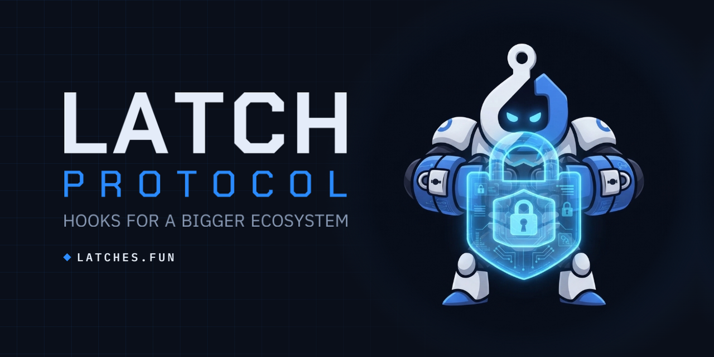

  

<h1 align="center">
  <picture>
    <source media="(prefers-color-scheme: dark)" srcset="assets/latch-lockup-transparent.png">
    
  </picture>
</h1>

<strong>Infrastructure other people ship on.</strong> 
Launch a DEX or a launchpad from one config file, on a core that is already deployed, verified and exercised.

  <a href="https://latches.fun">Site</a> ·
  <a href="https://latches.fun/docs">Docs</a> ·
  <a href="https://testnet.latches.fun/app">Try the app</a> ·
  <a href="https://latches.fun/ecosystem">Ecosystem</a> ·
  <a href="https://github.com/Latch-Protocol-Team/latch-sdk">SDK</a> ·
  <a href="https://github.com/Latch-Protocol-Team/dex-tokenl-list">Token list</a>

  <a href="https://x.com/Latchesdotfun">X</a> ·
  <a href="https://t.me/latchprotocol">Telegram</a>

---

## What you can build

| | You get | You set |
|---|---|---|
| **A launchpad** | Token factory, fair-launch pools that trade from the first block (no curve, no graduation migration), a decaying anti-snipe fee, an optional creator tax that expires itself, locked LP with a creator / integrator / protocol split, a hosted site with charts, creator and holder pages | your fee wallet, your terms inside the protocol's caps, which quote tokens you allow, your brand and theme |
| **A DEX** | Concentrated-liquidity and bin pools, a swap widget with quotes and price impact, pool pages, positions, analytics, a token list | your swap fee, which pools you route, your brand and theme |
| **A Latch** | A hook contract attached to a pool — revenue share, market hours, price bands, permissioned pools, launch guards — listed in an on-chain registry with attested permissions | the terms your pool enforces |
| **The tools around a launch** | Liquidity locks, token locks and vesting, team splits that pay out on their own, multisend, Merkle airdrops | the schedule, the payees, the weights |

Both site kinds are created from the app in one transaction and read everything they render from the chain: the owner, the brand, the terms, the launches, the trades. Nothing is curated, nothing is invented.

## How it works

- **One shared core per chain.** A vault, a concentrated-liquidity pool manager and a bin pool manager, deployed once, verified once. A tenant deploys a hook and a kit against it — never the core. One integration per chain covers every launchpad and DEX ever built on it, because every pool lives in the same two managers.
- **Latches are hooks.** Every product feature that touches a swap is a hook contract with an attested permission bitmap, so a trader can read exactly what sits in the swap path.
- **Launches open at a known price.** The wizard is market-cap first: you pick what the token is worth at birth, it shows you the snapped price the contract will actually use, and it never shows a dollar figure it could not read from a source.
- **Anti-snipe is a decaying fee, not a blocklist.** It starts high and reaches the pool's own fee over at least sixty seconds. The floor is a safety property: on a chain whose sequencer sets the timestamp, a ten-second window can be skipped entirely.
- **Bring your own pair.** A launch can be quoted in the native currency, a listed tokenised equity, or any ERC-20 you choose. A launchpad decides which of those its creators may use.
- **Revenue is enforced by contracts, never by SDK code.** Immutable caps in the contracts, per-launch terms frozen at creation, a protocol floor nobody can go below, and a fee controller behind a multisig and a timelock.
- **Stocks out of the box.** Tokenised equities are first-class quote assets where a chain lists them, with market-hours and price-band hooks written for them.
- **Admin keys that cannot hurt you.** Immutable contracts, two-step ownership with `renounceOwnership` disabled, delays that scale with how hard an action is to undo, and no key anywhere that can move a user's funds.
- **Latch has no token.** There is nothing to buy; the protocol earns from the fees its contracts enforce.

## What's next

In the order it arrives, with no dates attached. Everything here is a direction, not a promise.

- **Best-price routing, free through Latch pools.** A trade is quoted across venues and filled wherever it fills best. Routing through a Latch pool costs nothing extra; the fee applies only to a fill somewhere else, and it is read from the contract, never set by the app.
- **A quote and swap API for integrators.** The same routing behind an API and the SDK: ask for a quote, get back a transaction that has already been simulated. The fee is its own line in the quote, never folded into the price, and the backend never touches the trader's funds.
- **The `latch` command line.** One command with a guided stepper for the builder's first hour: scaffold a site, create a Launchpad, run a launch market-cap first, lock, airdrop, split. Every flow simulates before it offers to sign, and none of them ever asks for a raw private key.
- **Buy inside the launch transaction**, so a creator's first buy is not a race against the mempool.
- **More chains.** The same contracts at the same addresses per chain, with no bridge anywhere in the protocol path.

## Repositories

| Repository | What it is | Licence |
|---|---|---|
| [`latch-sdk`](https://github.com/Latch-Protocol-Team/latch-sdk) | TypeScript SDK: deployments, reads, launch building, market data, token lists — the MIT surface every integration builds against | MIT |
| [`dex-tokenl-list`](https://github.com/Latch-Protocol-Team/dex-tokenl-list) | The Latch token list, in the standard Token Lists schema, generated and verified on chain | MIT |
| `.github` | This profile, and the [ecosystem listing form](https://github.com/Latch-Protocol-Team/.github/issues/new/choose) | — |

The core is a GPL-2.0-or-later derivative of the Infinity architecture (`pancakeswap/infinity-core`), extended and hardened; Latch runs only on its own deployments and is not affiliated with any other protocol. The SDK, widgets and site template are independently authored and MIT, so nothing you ship on Latch has to inherit the GPL.

## Ship on Latch

Two ways in, both from the app — open today on the [testnet site](https://testnet.latches.fun/app), where the same code runs against a public testnet and the tokens have no value:

1. **Hosted** — build a launchpad or a DEX in the app, pick a theme, set your fee wallet and terms, sign one transaction. Your site is live at `/p/<address>` and can be served from your own domain.
2. **Self-hosted** — take the MIT site template (`create-latch-dex`), set the fee wallet and the chain in `latch.config.ts`, restyle if you like, deploy. It runs against the shared core and needs no Solidity of your own.

Either way the launchpad you build inherits the venue: one aggregator integration per chain covers every pool on it, so your launches are indexed on day one without any work of yours.

The [docs](https://latches.fun/docs) cover both, contract by contract.

Listing your launchpad, DEX or Latch in the ecosystem is an [issue form](https://github.com/Latch-Protocol-Team/.github/issues/new/choose), and the listing is read back from the chain before it is shown.

  <picture>
    <source media="(prefers-color-scheme: dark)" srcset="assets/powered-by-latch-dark.png">
    
  </picture>
  &nbsp;&nbsp;
  <picture>
    <source media="(prefers-color-scheme: dark)" srcset="assets/locked-by-latch-dark.png">
    
  </picture>

